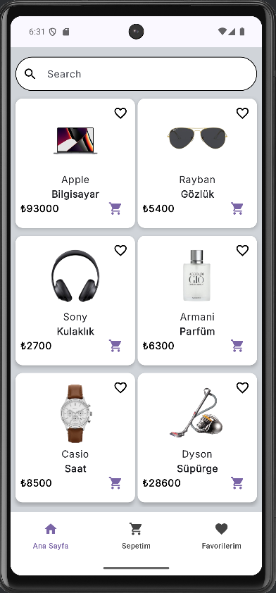
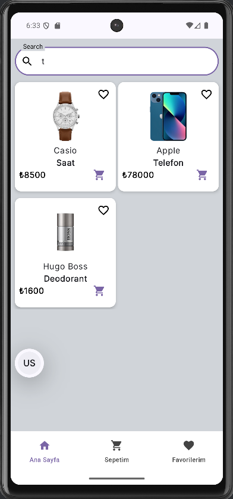
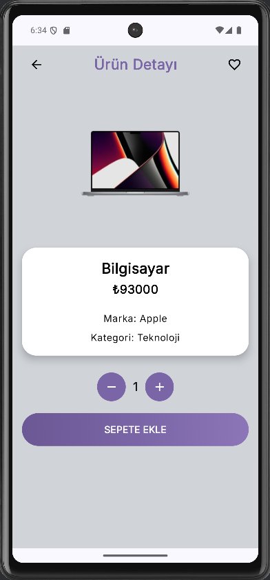
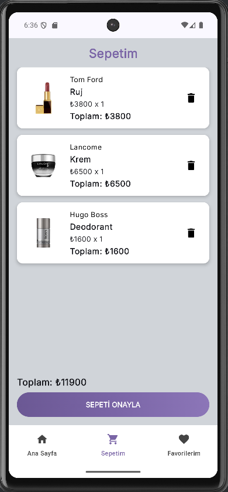
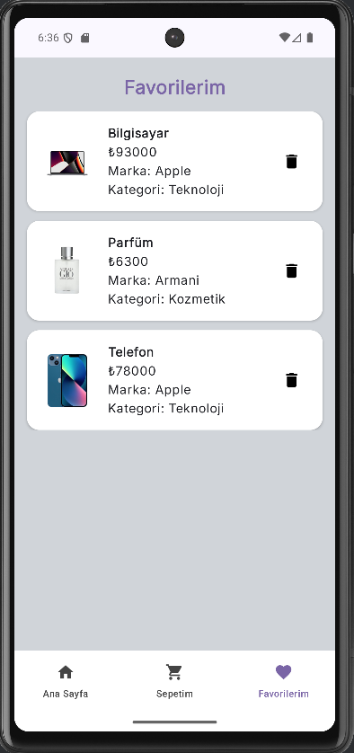

# PearlShop

Bu proje, **Techcareer.net'in düzenlediği Jetpack Compose for Android Bootcamp** programı kapsamında geliştirilmiş, modern Android geliştirme standartlarına uygun, Kotlin ve Jetpack Compose ile yapılmış bir e-ticaret mobil uygulamasıdır. Kullanıcıların ürünleri listelemesini, favorilerine eklemesini ve sepetini yönetmesini sağlayan temel e-ticaret işlevlerini barındırır.
## Özellikler

* **Ürün Listeleme:** Kullanıcıların tüm ürünleri kolayca görüntüleyebileceği ana ekran.
* **Ürün Arama:** Kullanıcıların istedikleri ürünleri adına göre hızlıca filtrelemesini ve bulmasını sağlayan işlevsel arama çubuğu.
* **Detay Görüntüleme:** Tıklanan ürünün görsel, fiyat, marka, ad gibi detay bilgilerinin gösterildiği detay ekranı. Bu ekrandan ürün adeti seçilerek istenilen adette ürünü sepete ekleme işlemi yapılır.
* **Favori Yönetimi:** Beğenilen ürünleri favorilere ekleme ve daha sonra görüntüleme imkanı.
* **Sepet Yönetimi:** Ürünleri sepete ekleme, sepetten çıkarma ve adet düzenleme.

## Proje Yapısı

Proje, Clean Architecture prensiplerine uygun olarak katmanlara ayrılmış bir yapıya sahiptir.

### 1. **Data Katmanı**
Uygulamanın veri kaynaklarını yönetir ve Repository desenini uygular. Bu katman, favori verileri için Room ile diğer tüm işlemler için ise Webservice ile iletişim kurar.

* `datasource`: Ana veri kaynaklarını ayırır.
    * **`Datasources`** sınıfı: Tüm ürün ve sepet işlemleri için API çağrılarını merkezi olarak yönetir.
    * `entity`: API'dan gelen veri modelleri ve Room tablosu (`FavoriteProducts`).
    * `local`: Sadece Favori ürünler için **Room** implementasyonları (`FavoritesDatabase`, `FavoritesDao`).
* `repos`: Repository sınıfları. (`ProductRepository` API ile, `FavoriteRepository` ise Room ile iletişim kurar.)
* `retrofit`: API ile iletişim için **`ApiService`** arayüzünü tanımlar.

### 2. **DI (Bağımlılık Enjeksiyonu) Katmanı**
Uygulama genelindeki bağımlılık yönetimini **Dagger Hilt** ile sağlar.

* `di`: Gerekli modülleri içerir (`AppModule`, `Constants`, `HiltApplication`).

### 3. **UI Katmanı**
Kullanıcıya gösterilen arayüzden ve sunum mantığından sorumludur.

* `viewmodels`: Ekranların durumunu yöneten ViewModel'lar (`CartViewModel`, `FavoriteViewModel`, `ProductViewModel`).
* `screens`: Tüm ana **Jetpack Compose** sayfaları (`CartScreen`, `DetailScreen`, `ProductList`, FavoriteScreen).
* `navigation`: Uygulama içi gezinme yollarını ve mantığını (`AppNavigation`, `BottomNavBar`) tanımlar.
* `theme`: Uygulamanın görsel temasını, renklerini ve yazı tiplerini tanımlar.

## Uygulama Görselleri

### 📱 Ana Sayfa


### 🔍 Ürün Arama


### 📋 Detay Sayfası


### 🛒 Sepet


### ❤️ Favoriler


## Teknolojiler

* **Dil:** Kotlin
* **Mimari:** MVVM (Model-View-ViewModel)
* **UI (Kullanıcı Arayüzü):** Jetpack Compose
* **Veri Akışı:** Kotlin Coroutines ve Flow
* **Ağ İşlemleri:** Retrofit ve Gson
* **Veritabanı:** Room
* **Bağımlılık Yönetimi:** Dagger Hilt

## Kurulum

```bash
git clone https://github.com/inci-demirci/PearlShop.git
cd PearlShop
./gradlew build
```

## Teşekkür

Bu proje, Kasım Adalan eğitmenliğinde gerçekleştirilen eğitim sürecinde geliştirilmiştir. Kendisine bilgi, rehberlik ve desteği için teşekkür ederim.

## İletişim

Proje hakkında soru, öneri veya geri bildirimleriniz için benimle iletişime geçebilirsiniz:

**E-posta:** inci.dmrcii@gmail.com
**LinkedIn:** https://www.linkedin.com/in/inci-demirci/
